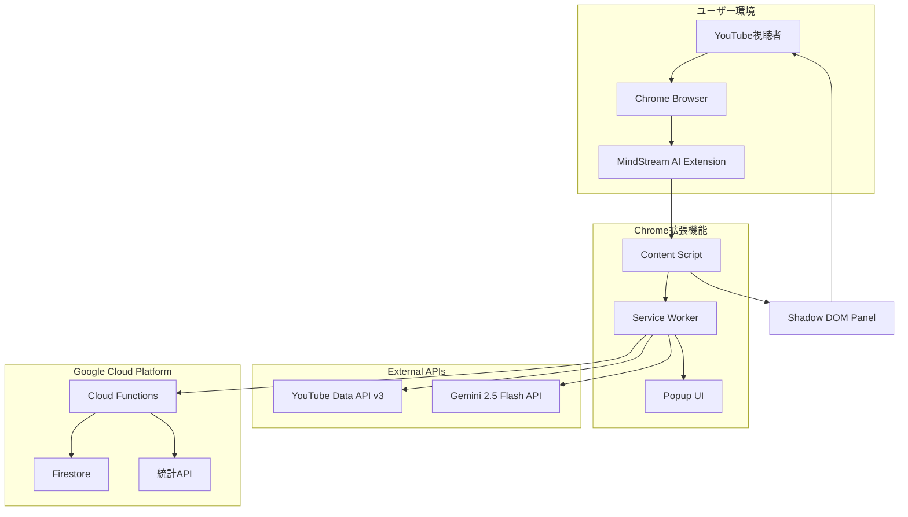

# はじめに

こんにちは！Google Cloud AI Agent Hackathon 2025に参加している渡邊です。

今回、私が開発したのは「**MindStream AI**」という、YouTube医療動画のコメントをAIで整理し、視聴者同士の体験談共有を促進するChrome拡張機能です。

なぜこのツールを作ったのか？それは、日本の精神医療が抱える深刻な問題と、それに対するYouTubeの新しい役割に着目したからです。

# 解決したい課題：419万人の声なき声

## 日本の精神医療の現状

現在、日本には**419万人**の精神疾患患者がいます。しかし、診療を受けるまでに**3〜6ヶ月**の待機期間があるのが現実です。この長い待機期間の間、多くの患者や家族は不安を抱えながら過ごしています。

そんな中、医療系YouTuberの存在が大きな支えとなっています。特に精神科医の**益田裕介先生**は、登録者数**66万人**を超える人気チャンネルを運営し、毎週のライブ配信で視聴者の質問に答えています。

## YouTubeコメントに潜む4つの問題

しかし、益田先生のライブ配信を分析してみると、以下の問題が見えてきました：

### 1. 情報の埋没問題
- 毎回の配信で**100件以上**のコメントが投稿される
- スーパーチャット（投げ銭）の質問のみが回答される
- 貴重な体験談や質問が埋もれてしまう

### 2. 体験の孤立問題
- 「私だけが苦しんでいるのか...」という孤独感
- 似た症状や悩みを持つ人同士がつながれない
- 体験談の共有が困難

### 3. 医療情報の信頼性問題
- コメント欄に医療デマが混在するリスク
- 素人の誤った助言による健康被害の懸念
- 薬機法に違反する表現の氾濫

### 4. 継続性の欠如
- 単発の視聴で終わってしまう
- フォローアップがない
- 知識が蓄積されない

これらの問題を解決するために生まれたのが、MindStream AIです。

# ソリューション：MindStream AI

## コンセプト：「医療情報を、もっと見つけやすく、共有しやすく」

MindStream AIは、YouTube医療動画のコメントをGoogle CloudのAI技術で自動的に分析・整理し、視聴者同士の体験談共有を促進するChrome拡張機能です。

## 主要機能

### 1. AIによるコメントクラスタリング

**Gemini 2.5 Flash**を活用し、コメントを以下のように自動分類：

- 💊 薬に関する体験談（45件）
- 😰 診断前の不安・悩み（32件）
- 👨‍👩‍👧‍👦 家族・周囲の理解（28件）
- 📝 治療・対処法の体験談（18件）

各クラスターには、緊急度（high/medium/low）と医療関連度（0.0〜1.0）を付与し、重要なコメントを見逃さない仕組みになっています。

### 2. 体験談マッチング機能

似た症状や悩みを持つ人のコメントを発見しやすくする機能：

- キーワード検索
- 類似度計算による関連コメント表示
- 体験者プロファイル表示（匿名性を保持）

### 3. 薬機法準拠の医療情報管理

医療情報を扱う上で最も重要な法規制への対応：

```javascript
// medical-compliance.jsによる自動チェック
const prohibitedExpressions = {
  診断: [
    /診断(します|できます)/,
    /あなたは.{0,10}(病|症|障害)です/
  ],
  治療効果: [
    /必ず(治る|改善|効果)/,
    /副作用は(ありません|ない|ゼロ)/
  ]
};
```

- NGワードの自動検出とフィルタリング
- 免責事項の常時表示
- 「個人の体験談」であることの明確化

### 4. Cloud Functionsによるキャッシュシステム

パフォーマンス向上とAPI使用量削減のため、Google Cloud Functionsを活用：

- 分析結果を**Firestore**にキャッシュ
- 24時間の有効期限で自動削除
- 統計情報の収集と分析

## 技術的な特徴

### Chrome Extension Manifest V3対応

2024年以降の新規拡張機能に必須のManifest V3に完全対応：

```json
{
  "manifest_version": 3,
  "name": "MindStream AI",
  "permissions": ["storage", "activeTab", "alarms"],
  "background": {
    "service_worker": "src/background/service-worker.js"
  }
}
```

### Shadow DOM採用によるスタイル隔離

YouTubeのスタイルとの競合を完全に防ぐため、Shadow DOMを採用：

```javascript
const shadowRoot = container.attachShadow({ mode: 'closed' });
shadowRoot.innerHTML = `
  <style>${panelStyles}</style>
  <div id="mindstream-panel">...</div>
`;
```

### リアルタイム分析とフォールバック

- YouTube動画を開くと自動的に分析開始
- Gemini APIが利用できない場合はローカルクラスタリング
- APIキーなしでもサンプルデータで動作確認可能

# システムアーキテクチャ

## 全体構成図



## 技術スタック

### フロントエンド（Chrome拡張機能）
- **言語**: Vanilla JavaScript（ES Modules）
- **UI**: Shadow DOM + Custom CSS
- **通信**: Chrome Extension APIs
- **ストレージ**: chrome.storage.local

### バックエンド（Google Cloud）
- **Cloud Functions**: Node.js 20
- **データベース**: Firestore
- **キャッシュ**: 24時間TTL
- **CORS**: 全オリジン許可（開発用）

### AI・API
- **Gemini API**: gemini-2.5-flash モデル
- **YouTube Data API**: v3（コメント取得）
- **レート制限**: 15 RPM（Gemini）、10,000ユニット/日（YouTube）

# 実装のポイント

## 薬機法対応の工夫

医療情報を扱う上で最も重要だったのが、薬機法（医薬品医療機器等法）への対応です。

### 1. 包括的なコンプライアンスチェッカー

`medical-compliance.js`として、以下の機能を実装：

- 禁止表現の自動検出（診断、治療効果、医学的助言）
- 注意表現への警告
- 推奨表現の提案
- 緊急キーワード（自殺念慮など）の検出

### 2. 常時表示される免責事項

```javascript
const DISCLAIMER_TEXT = `このツールは医療情報の整理を支援するものであり、
医療行為や診断を行うものではありません。
健康に関する判断は必ず医師にご相談ください。
緊急時は迷わず119番通報してください。`;
```

## Chrome拡張機能開発の工夫

### 1. Service Workerでの非同期処理

Manifest V3では、background.jsの代わりにService Workerを使用する必要があります：

```javascript
// 動的インポートによるモジュール読み込み
const loadModules = async () => {
  const [
    { default: youtubeAPI },
    { default: geminiAPI },
    { default: storage }
  ] = await Promise.all([
    import('../api/youtube-api.js'),
    import('../api/gemini-api.js'),
    import('../utils/storage.js')
  ]);
  return { youtubeAPI, geminiAPI, storage };
};
```

### 2. 多層的なフォールバック

APIの失敗に備えて、5段階のフォールバック処理を実装しています。

## Google Cloud活用のポイント

### 1. Cloud Functionsでのスケーラビリティ

```javascript
// Firestoreトランザクションで統計更新
await firestore.runTransaction(async (transaction) => {
  const doc = await transaction.get(statsRef);
  const currentValue = doc.data()[field] || 0;
  transaction.update(statsRef, {
    [field]: currentValue + value,
    lastUpdated: new Date().toISOString()
  });
});
```

### 2. Firestoreでの効率的なキャッシュ管理

- documentIdとしてvideoIdを使用
- TTLベースの自動削除
- 統計情報の原子的更新

# デモ動画

以下の動画で、MindStream AIの実際の動作をご覧いただけます：

[YouTube動画をここに埋め込み - 3分以内のデモ]

動画では以下の機能を実演しています：
1. Chrome拡張機能のインストール
2. YouTube動画でのコメント分析
3. クラスター表示と体験談の確認
4. 薬機法対応の免責事項表示

# 今後の展望

今後は、ピアサポート機能（匿名チャット）、危機介入システム（自殺リスク検知）、知識ベース構築（過去配信の検索）などの実装を予定しています。

# まとめ

MindStream AIは、単なる技術デモではありません。**419万人の精神疾患患者**と、その家族、そして**66万人の益田先生の視聴者**のために作った、実用的なツールです。

Google CloudのAI技術（Gemini 2.5 Flash）とインフラ（Cloud Functions、Firestore）を活用することで、以下を実現しました：

1. **埋もれていた声を可視化** - AIクラスタリングで重要なコメントを発見
2. **孤立していた体験を共有可能に** - 体験談マッチングで似た悩みを持つ人をつなぐ
3. **医療情報の安全性を確保** - 薬機法準拠のコンプライアンスチェック

このハッカソンを通じて、技術が人々の健康と幸せに貢献できることを改めて実感しました。

最後に、このプロジェクトを支えてくださったGoogle Cloud Japan teamの皆様、そして精神医療の現場で日々奮闘されている益田裕介先生をはじめとする医療従事者の皆様に、心から感謝申し上げます。

---

**GitHubリポジトリ**: https://github.com/yourusername/mindstream-ai  
**お問い合わせ**: support@mindstream-ai.example.com

#aiagentzenn #googlecloud