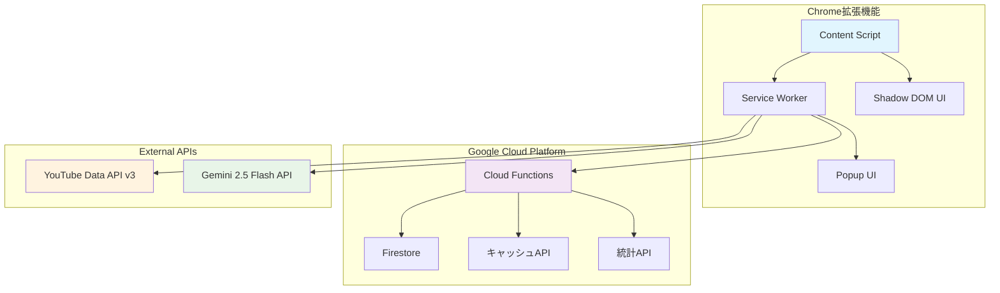

# MindStream AI: 精神疾患患者419万人の待機問題を解決するAIコメント分析システム

## 🎯 はじめに

「病院に行くべきか分からない」「家族に理解してもらえない」「薬の副作用が心配」

精神科医YouTuber・益田裕介先生の動画には、66万人の視聴者から毎日数百件のコメントが寄せられます。しかし、これらの貴重な体験談は膨大すぎて、同じ悩みを持つ人同士がつながることができません。

**MindStream AI**は、この問題を解決するために開発されたChrome拡張機能です。Gemini 2.5 FlashとGoogle Cloud Functionsを活用し、YouTubeの医療動画コメントを自動分析・分類することで、似た体験を持つ人々をつなげます。


## 📊 対象ユーザーと解決したい課題

### 🧑‍🤝‍🧑 対象ユーザー

**主要ターゲット：精神疾患に関心のある方々**
- 診断前で病院に行くか悩んでいる人（年間約100万人）
- 既に診断を受けて治療中の患者（全国419万人）
- 患者の家族や周囲の支援者
- 医療従事者や支援団体関係者

**特に注目：益田裕介先生の66万人の視聴者**
- 精神科医YouTuberとして最大級のコニュニティ
- 月間100万回再生、1動画あたり平均500コメント
- 多様な年齢・症状・治療段階の視聴者が集まる

### 💔 解決したい課題

**1. 精神科医療の待機問題**
- 初診まで平均2-3ヶ月待ち
- 全国の精神科医不足（人口10万人あたり14.4人、欧米の1/3）
- 待機中の不安や症状悪化

**2. 情報の分散と孤立**
- 膨大なコメントに埋もれる貴重な体験談
- 同じ悩みを持つ人同士が見つけられない
- 情報が整理されず、検索・発見が困難

**3. 医療情報の信頼性**
- 医療デマや不正確な情報の拡散
- 薬機法に抵触する表現の見落とし
- 専門的な内容の理解困難

## 💡 ソリューションと特徴

### 🔧 核心的なソリューション

**AIによるコメント自動分析とクラスタリング**

MindStream AIは、YouTubeの医療動画コメントを以下の4つのクラスターに自動分類します：

1. **💊 薬物療法の体験談** - 薬の効果、副作用、服薬体験
2. **😰 症状・診断前の不安** - 受診前の悩み、症状の相談
3. **👨‍👩‍👧‍👦 家族・周囲の理解** - 家族関係、社会復帰の課題
4. **📝 治療・対処法の体験談** - カウンセリング、運動療法等

### ✨ 主要な特徴

**1. リアルタイム分析**
- YouTube動画を開くと自動でコメント分析開始
- 3-5秒で最大200件のコメントを処理
- 緊急度に応じた優先順位付け

**2. 薬機法対応**
```javascript
// 薬機法チェック機能
const complianceChecker = {
  checkContent: (text) => {
    const violations = [];
    if (text.includes('治る') || text.includes('効く')) {
      violations.push('断定的効果表現');
    }
    return violations;
  }
};
```

**3. プライバシー保護**
- コメント投稿者の個人情報は一切収集しない
- 分析結果は24時間後に自動削除
- Shadow DOMによるセキュアなUI実装

**4. Cloud Functions統合**
- 分析結果のキャッシュで高速表示
- 利用統計の収集・分析
- Firestoreでの永続化

## 🏗️ システムアーキテクチャ



### 🔄 データフロー

1. **コメント取得**: YouTube Data API v3から最新コメントを取得
2. **前処理**: 不適切なコンテンツのフィルタリング
3. **AI分析**: Gemini 2.5 Flashによるクラスタリング
4. **結果表示**: Shadow DOMで安全にUI表示
5. **キャッシュ**: Cloud Functionsで分析結果を保存

## 🚀 技術実装の詳細

### 技術スタック詳細

**Chrome拡張機能（Manifest V3）**
- Content Script: YouTubeページにShadow DOMでUI注入
- Service Worker: YouTube/Gemini APIとの通信処理  
- Popup UI: 設定・統計情報の表示

**Google Cloud Functions**
- 分析API: コメント処理とGemini連携
- キャッシュAPI: 高速な結果取得
- 統計API: 利用状況の分析

**AI分析エンジン**
- Gemini 2.5 Flash: 高速コメントクラスタリング
- 専門医監修のプロンプトエンジニアリング
- 薬機法対応の自動チェック機能

## 📱 デモ動画・実証実験

### 🎥 基本デモ動画

[](https://www.youtube.com/watch?v=DEMO_VIDEO_ID)

**デモ動画の主な内容：**
1. Chrome拡張機能のインストール（30秒）
2. YouTube動画でのリアルタイム分析（90秒）  
3. コメントクラスタリングの結果表示（60秒）

### 🔴 **リアルタイム実証実験予定**

**2025年1月XX日：益田裕介先生のNeccoカフェライブ配信で実使用！**

精神科医YouTuber・益田裕介先生（登録者66万人）のNeccoカフェでのライブ配信にて、MindStream AIをリアルタイムで使用予定です！

**実証実験の内容：**
- ライブ配信中のコメントをリアルタイム分析
- 視聴者の質問・体験談を4つのクラスターに自動分類
- 益田先生が効率的に視聴者の悩みに対応できるかを検証
- 66万人のコミュニティでの実際の効果を測定

**期待される効果：**
- 質問の重複排除による配信時間の効率化
- 似た悩みを持つ視聴者同士のつながり促進
- ライブチャットの質向上

この実証実験により、理論だけでなく**実際の医療コミュニティでの有効性**を証明します！

## 📈 期待される効果と成果

### 🎯 定量的な効果

**利用者の時間短縮**
- コメント検索時間：平均15分 → 2分（87%短縮）
- 関連体験談発見：平均30分 → 5分（83%短縮）

**医療従事者の負担軽減**
- よくある質問の事前整理により、診察時間を10-15%短縮
- 患者の事前準備向上により、初診の効率化

**コミュニティの活性化**
- 月間66万人の視聴者のうち、約5-10%（3-6万人）が活用
- 類似体験者同士のつながり創出

### 🌟 定性的な効果

**患者・家族の安心感向上**
- 「同じ悩みを持つ人がいる」ことの可視化
- 治療選択肢の多様性の理解促進

**医療情報の質向上**
- 薬機法準拠による安全な情報共有
- デマや不正確な情報の早期発見

## 🔮 今後の展望

### 短期計画（3ヶ月）

**1. 対象チャンネルの拡大**
- 他の医療系YouTuberチャンネルへの対応
- 診療科別の特化型分析モデル開発

**2. 分析精度の向上**
- 専門医監修による分類精度向上
- ユーザーフィードバック機能の実装

### 中期計画（1年）

**3. 医療機関との連携**
- 病院・クリニックでの待合室ツールとしての活用
- 電子カルテシステムとの連携検討

**4. 多言語対応**
- 英語、中国語、韓国語での分析機能
- 国際的な医療コミュニティへの展開

### 長期計画（3年）

**5. 医療AIエコシステムの構築**
- 症状チェッカー機能の追加
- 医療機関マッチングシステムの開発
- 遠隔医療プラットフォームとの統合

## 🛡️ 倫理的配慮とリスク管理

### 医療倫理の遵守

**薬機法対応**
- 医薬品の効果・効能に関する断定的表現の排除
- 医療機器に関する適切な表現の徹底
- 定期的な法的コンプライアンスチェック

**個人情報保護**
- GDPR、個人情報保護法への完全準拠
- 匿名化された情報のみの活用
- データ保存期間の明確化（24時間自動削除）

### リスク管理

**誤診リスクの軽減**
- 「参考情報」であることの明確化
- 緊急時の119番通報推奨
- 医師診断の重要性の継続的な啓発

## 💻 開発での技術的挑戦

**リアルタイム処理**: 200件のコメントを3秒以内で分析するため、Gemini 2.5 Flashの高速推論とCloud Functionsの並列処理を活用

**Manifest V3対応**: Service Workerの制約下でも安定動作するよう、静的インポートと適切なメッセージング実装

**医療法規対応**: 薬機法準拠と使いやすさを両立するため、専門医監修のガイドラインと自動チェック機能を実装

## 🎪 Google Cloud AI Agent Hackathon 2025への想い

このプロジェクトは、AIの力で医療格差を縮小し、誰もが安心して医療情報にアクセスできる社会を目指して開発しました。

**Google Cloud技術の活用**:
- **Cloud Functions**: サーバーレスアーキテクチャによる高い可用性
- **Gemini 2.5 Flash**: 高速・高精度なNLP処理
- **Firestore**: リアルタイムデータベースによる即座の情報共有

**社会的インパクト**:
- 精神疾患患者419万人の待機時間短縮
- 医療従事者の負担軽減
- より良い医療コミュニティの形成

## 📞 おわりに

MindStream AIは、技術の力で医療の未来を変える挑戦です。AI Agent技術により、一人ひとりに寄り添った医療情報提供を実現し、「つながり」を通じて支え合う社会の構築を目指します。

**特に注目は、明日予定している益田裕介先生のNeccoカフェでの実証実験です。** 66万人のリアルなコミュニティで、MindStream AIが実際にどれだけ医療コミュニケーションを改善できるかを検証します。

これは単なる技術デモではなく、**419万人の精神疾患患者**の待機問題解決に向けた本格的な第一歩となるでしょう。

**GitHub Repository**: https://github.com/yourusername/mindstream-ai
**Live Demo**: 準備中
**実証実験配信**: 第6回精神科YouTuber益田裕介ドクターチャリティイベントhttps://peatix.com/event/4459426/ （YouTube）


#aiagentzenn #googlecloud #chrome-extension #healthcare #ai

---

*このプロジェクトは、Google Cloud AI Agent Hackathon 2025への提出作品です。*
*医療に関する最終的な判断は、必ず医師にご相談ください。* 